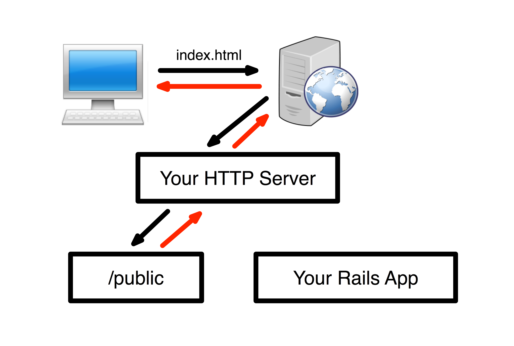

# [fit] Speedy
# [fit] Rails Apps

---

# Story of an unlaunched Rails app

- A mobile homepage for a Fortune 50 company.

- Rails, RefineryCMS, jQuery Mobile.

- Client is excited for a mobile site.

- Devs are excited for a green field to use latest tech. (jQuery Mobile Beta and MongoDB)

---

# Four Months Later

## I'm called in to rescue the project.

---

# Standard Rescue Project

- Behind schedule
- Busted budget
- Everybody is sick of it 
- Nobody believes in it
- But we gotta finish it


---

# Standard Rescue Procedures

- Bring in new developers.

- Build a list of must-haves for launch.

- Work the list

- And at the top of their list was...

---

# [fit] **Make**
# [fit] **the site**
# [fit] **go fast!**

---

# Slow Rails App

A page on this _mobile-only_ site **took 2.5 to 8 seconds for a server response.**

Server responses times were very **inconsistent**, and crashed under any load.

With jQuery Mobile, **the site felt even slower.**

---

# No Escape

###Data sat in a poorly-designed MongoDB database.

###Data used in multiple controllers, subsites.

###The views were a mess.

###The authors were incredibly opinionated.

---


---

# No Hope?


---

# [fit] Until I found the
# [fit] One Line Fix

---

### [fit] caches_page :view

---
## In full context

```ruby
class ContentController < ApplicationController

  caches_page :the_slowest_action_in_the_world

  def the_slowest_action_in_the_world
    # same ol' busted code
  end

end
```

---


---


---



---

# Page Caching Improvements

- 2.5 to 8 seconds response dropped to <80 ms.

- Server response was very consistent.

- Site felt snappier.

- It took little code to accomplish.

- Client approved, the site launched.

---

# Page Caching Costs

- Cache invalidation

- User-specific content

- "The Rails Way"

- Hosting support

---

# Cache Invalidation

## It's easy...
## Just delete all of those files Rails wrote!

---

# Cache Invalidation

```ruby
def files_to_remove
  `cd public;git status -u`
    .split("\n")
    .select { |f| f.starts_with?('#') }
    .select { |f| f.ends_with?('.html') }
    .map    { |f| f.gsub('#', '').strip }
end

files_to_remove.each { |x| `rm public/#{x}` }

```

---

# User-specific Content

User could select their closest dealer.

Layout ERB page: "Your closest dealer is [X]"

Moved message to client-side jQuery render

Data populated through AJAX

---

# Deviating From "The Rails Way"

"Static page caching for Action Pack (removed from core in Rails 4.0)."

"NOTE: It will continue to be officially maintained until Rails 4.1."

"See DHH's key-based cache expiration overview for the newly-preferred method."

## - Rails Docs

---


---

# Hosting Support

## Can't write to /public, it won't work.

### (looking at you, Heroku)

---

# So When Should You Consider Page Caching?

"Content management systems -- including weblogs and wikis -- have many pages that are a great fit for this approach, but account-based systems where people log in and manipulate their own data are often less likely candidates."

## - Rails Docs

---

# Additional Thoughts

- Page caching is not all-or-nothing.

- Requires planning and thought.

- It could be a way to stretch your hosting dollar.

- May not be elegant, but IT WORKS.
